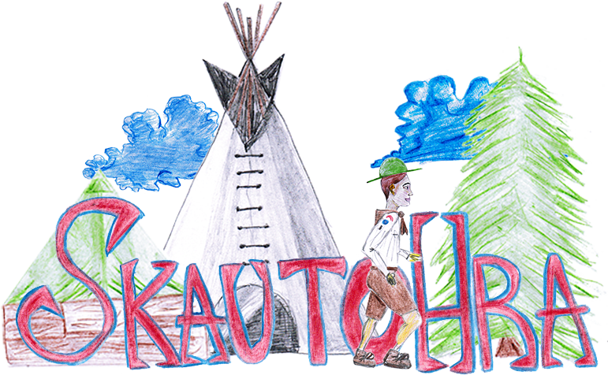

"Skautohra" (or ScoutJumper) is a small project we did with my brother Steve overnight to promote our ball. It is a simple platformer-like game where you run and jump over obstacles. The game has hand-drawn graphics, is written in TypeScript and uses Phaser as a game engine. The highscore data is stored in Firebase. This game uses web browser as a runtime environment.

## How to build and run the game
- install dependencies with `npm install`
- build the game using `webpack`
- run any HTTP server, such as [http-server](https://www.npmjs.com/package/http-server) to serve the staic files from the root directory
- open the URL of the local server in your web browser